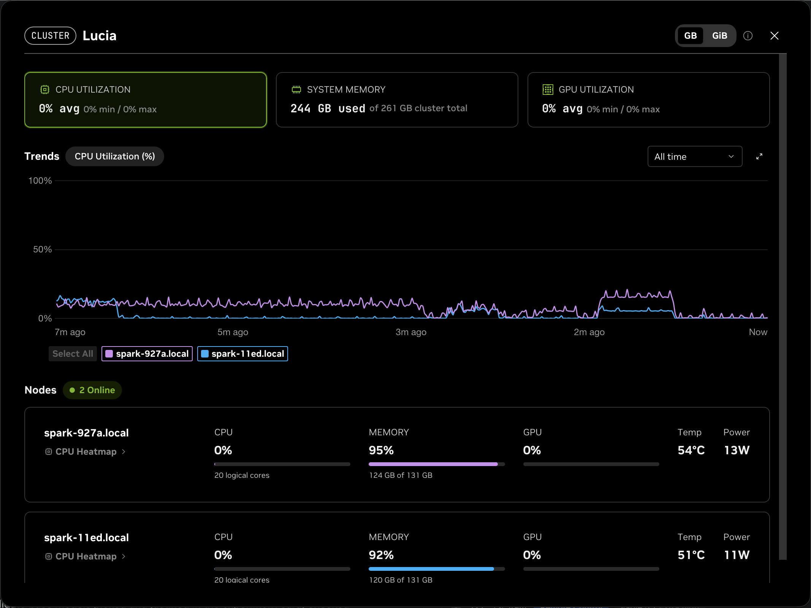
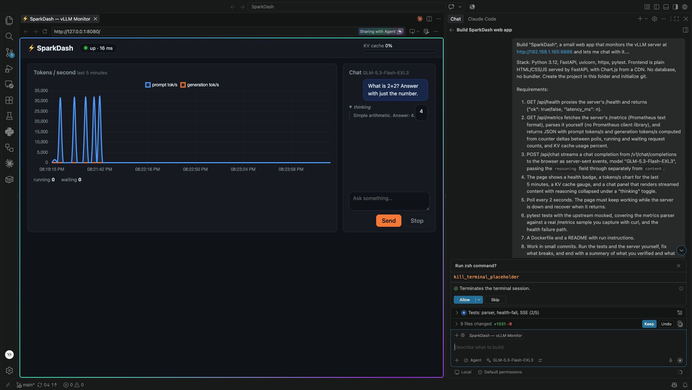
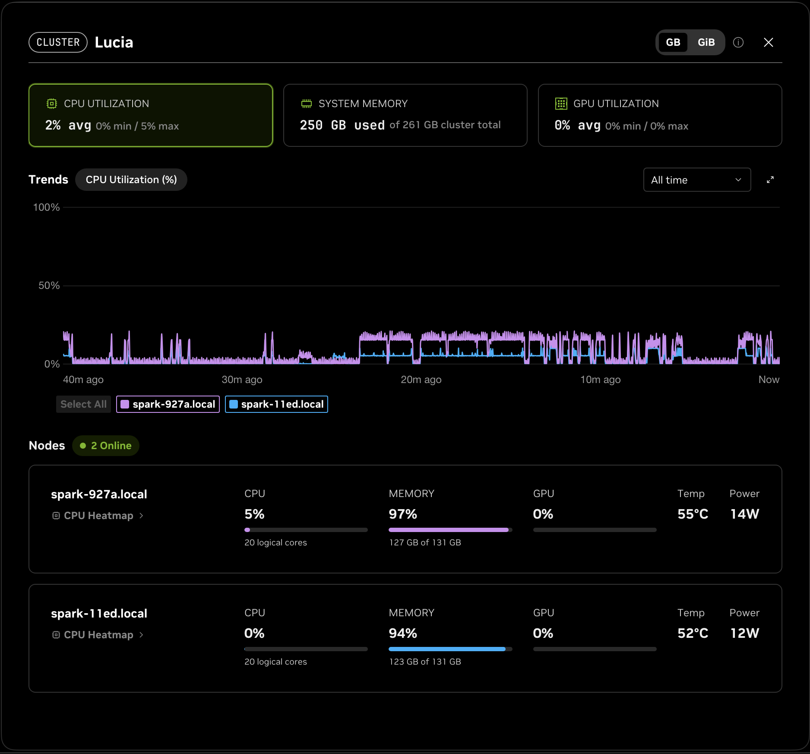

> I gave GLM-5.3-Flash a written spec to build a monitor and chat UI for the very vLLM server that was serving it — then scored the result against questions I wrote down before the session started.



*NVIDIA Sync's cluster view minutes after the server came up: 244 GB of 261 GB in use, 124 GB on one node and 120 GB on the other, holding one model between them.*

## The setup

Two NVIDIA DGX Spark machines, connected by a ConnectX-7 cable, running GLM-5.3-Flash — a 320B mixture-of-experts model, 18B active per token — as a 4-bit EXL3 quantization, served by vLLM with tensor parallelism across both nodes. The head node exposes an OpenAI-compatible API on port 8888. This is the [MiaAI-Lab recipe](https://github.com/MiaAI-Lab/GLM-5.3-Flash-EXL3-2x-DGX-Sparks), and I brought the cluster up the same day I ran this test. How that went — the recipe choice, the port mapping, and the five things that broke on the way to the first correct answer — is its own post: [Bringing a 320B model up across two DGX Sparks](TODO-link-to-deployment-post).

I drove the model from VS Code, GitHub Copilot Chat in agent mode, pointed at the endpoint as a custom OpenAI-compatible backend.

This was the first agentic coding test after the cluster came up. I wrote the spec before the session started, and I scored it afterward.

## Why this test

I wanted a task where every claim could be checked with curl. Not "write a to-do app" — that verifies nothing. A dashboard for the vLLM server itself meant every number the model produced could be compared against ground truth sitting on the same LAN. If the code said the server was healthy, I could ask the server.

That constraint shaped the whole spec: real data, real failure modes, mockable boundaries.

## The spec, summarized

Build "SparkDash", a small web app that monitors vLLM at `http://192.168.1.165:8888` and lets me chat with it. Python 3.12, FastAPI, httpx, pytest. Plain HTML/CSS/JS served by FastAPI, Chart.js from a CDN. No database, no bundler. Under about 800 lines excluding tests. The eight requirements, verbatim, live in the [repo README](https://github.com/vondraysanford/SparkDash#how-this-was-built); in short:

- proxy `/health` as `/api/health`, returning ok plus latency
- parse the Prometheus `/metrics` text **by hand** — no client library — and derive prompt and generation tok/s from counter deltas, plus running/waiting requests and KV cache usage
- stream `/v1/chat/completions` as SSE, handling reasoning separately from content
- a dashboard page: health badge, 5-minute tok/s chart, KV gauge, chat panel with reasoning collapsed under a "thinking" toggle
- poll every 2 seconds; the page must survive the server going down and recover
- pytest with the upstream mocked, including the metrics parser tested against a **real /metrics sample captured with curl** — not an invented one
- Dockerfile and README
- work in small commits, run the tests and fix what breaks, end with an honest summary of what was verified and what was not

## What the build looked like from my side

From the transcript, the order went: environment setup, a curl capture of the real `/metrics` output (committed as a 66,656-byte test fixture), the backend, the frontend, the tests, then Docker and README, then live verification. Three commits came out of the session on top of the initial repo commit, the first at 19:45 and the last at 20:29.



*Mid-build. The dashboard is already up in VS Code's browser tab, health at 16 ms, the model answering "What is 2+2?" with its reasoning folded under the thinking toggle. On the right, the agent session: the spec, 9 files changed, and the test task at 2 of 5.*

Where the model was strong:

- **It probed before writing.** It discovered that this vLLM build puts reasoning in `delta.reasoning`, not `reasoning_content`, and that a single delta can carry reasoning *and* content at once. It coded to what the server actually does, not to what a blog post claims.
- **The test seam was designed in from the start.** An `httpx.AsyncClient` factory function made the whole upstream swappable, which is why 16 tests with `MockTransport` and a live-failure/recovery scenario all pass.
- **It hit the size budget itself.** The draft came to 868 lines against a ~800 target; it trimmed its own frontend to 864 and re-checked JavaScript syntax.

Where it stumbled. Three things broke that are worth quoting:

The first draft of `app/main.py` had outright syntax errors, including a literal typo of "0 zeros" in the code. It couldn't be patched, so it was deleted and rewritten.

The httpx mock tests failed with:

```
AssertionError: isinstance(response.stream, AsyncByteStream)
```

The cause was passing a generator as response content when MockTransport needed bytes. Fixed by passing complete byte payloads in the tests.

The sneakiest one: a test helper that bumped counter values did a string replace against the fixture, but joined labels with `", "` (comma-space) while the real Prometheus output uses `","` (no space). Replace silently matched nothing — a test that would have passed against a broken implementation. The fix joined with `","` *and* added `assert old in text` so a no-op fails loudly next time. That one matters: a silent test no-op is worse than a failing test.



*What the cluster looked like while it built: CPU bursts on the head every time the agent thought, memory pinned at 97 and 94 percent, and NVIDIA Sync's GPU gauge reading zero the whole time, even while the model was answering. That last one is worth its own investigation.*

## The scorecard

I wrote these questions down before the session. Answers below, honestly.

**Was the real metrics sample fetched or invented?** Fetched. Captured with curl from the live server and committed as `tests/data/metrics_sample.txt`, 66,656 bytes. Tests assert all five expected metric names are present and values are in plausible ranges.

**Was the counter-delta math right?** The tests say yes, and the browser agreed. First poll is zero-rate by design; a controlled delta of 200 prompt / 40 generation tokens over 2 seconds yields 100/s and 20/s; a counter reset clamps to zero instead of going negative. SSE and polling both worked live, though the tok/s spike I saw during recovery (17,589 prompt tok/s in one poll) reflects other traffic hitting the box, not a benchmark.

**Were failing tests fixed at the cause or the assertion?** At the cause, in the two cases I could trace. The MockTransport failure was a test bug; the label-join failure exposed a silent no-op and got a loud assertion added. One caveat: I reviewed the fixes, but I did not line-by-line audit all four failures.

**Does recovery work?** Yes, and this was the test I cared about most. The model spun up a mock vLLM upstream, pointed a second instance at it, killed the mock: `ok: false`, zeroed metrics, chat errors surfaced as an event frame. Restarted: `{"ok":true,"latency_ms":7}`, with nonzero delta rates on the following poll. The real server was never taken down — that's a mock-verified path, not a production incident.

[image: evidence/2026-09-13-server-down-recovery.gif — the badge going red on `./start.sh stop` and polling resuming when the server returns; the real-server version of the test above]

[image: evidence/2026-09-13-dashboard-streaming.gif — a chat streaming with the thinking toggle open while the generation tok/s line rises]

**How many interventions?** One message from me during the build (the wrap-up request after the terminal work). Everything else, including fixes to its own bugs, was autonomous.

**Was the final summary truthful?** Yes. It listed what was not verified — Docker never built, only the integrated browser tested, the real server never taken down — and marked gaps it couldn't remember with `[not in context]` instead of filling them in. A model willing to write "not verified" is worth more than one that writes confident prose.

## The numbers

| Metric | Value |
|---|---|
| Commits made during the session | 3 (plus 1 pre-existing initial commit) |
| Tests passing | 16 / 16 |
| App code lines (excluding tests) | 864 |
| Test code lines | 369 |
| Test fixture size | 66,656 bytes |
| Human interventions during the build | 1 |
| Session length | 44 minutes, first commit at 19:45 to last build commit at 20:29, plus the setup before the first commit |
| Docker image builds attempted | 0 — still not built as of publishing; it is the first open item in the session summary |

## What I would do differently next time

- **Register the scorecard as an input, not a scoring step.** I wrote the questions down beforehand but only gave the model the functional spec. Handing it the same checklist might have pushed it toward the honest-summary behavior on the first pass instead of after a nudge.
- **Ask for a browser screenshot at each milestone.** I verified the dashboard myself at the end; checkpoint screenshots would have caught visual regressions earlier and given me an audit trail.
- **Set the line budget as a tracked constraint from the start.** The 868-line draft was caught late; a mid-build check would have shaped the frontend code the first time instead of requiring a trim commit afterward.

## Where to find it

The repo is [SparkDash](https://github.com/vondraysanford/SparkDash) — backend, frontend, 16 tests, Dockerfile, README with the full spec, and an `evidence/` folder containing [the session summary](https://github.com/vondraysanford/SparkDash/blob/main/evidence/2026-09-13-agent-session-summary.md) this post is based on, including the commit hashes, live curl outputs, and the exact error text quoted above. The captured `/metrics` fixture is committed under `tests/data/` so the parser tests run against real server output, not a reconstruction.
